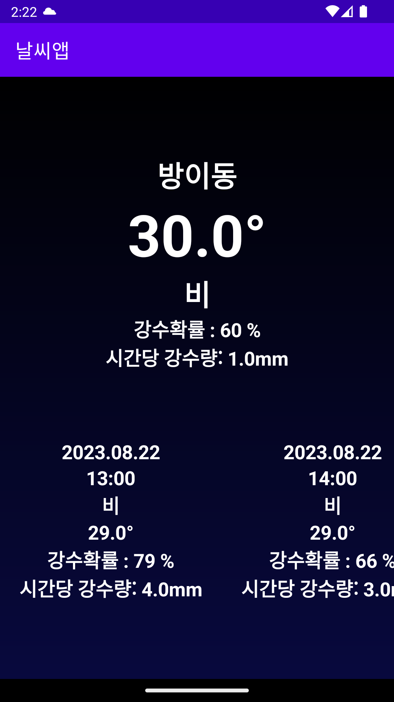
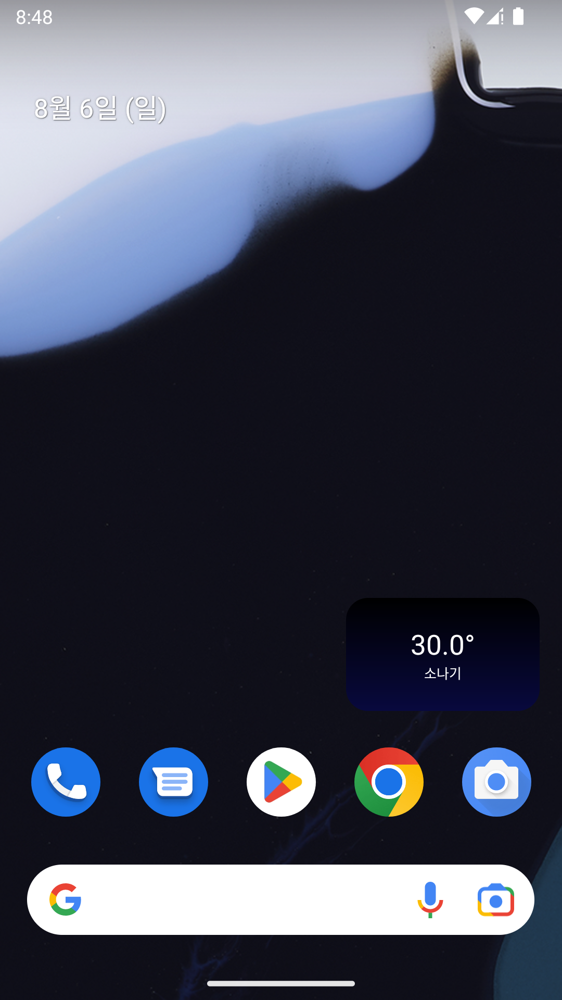

# 날씨앱 (WeatherInfoApp)

현재 위치 기반으로 기상청 단기예보(공공데이터포털) API를 호출해 오늘 날씨와 3일간의 시간별 예보를 보여주는 안드로이드 앱입니다.
홈 화면 위젯으로도 날씨를 확인할 수 있습니다.

## 스크린샷

| 앱 화면 | 홈 화면 위젯 |
| :---: | :---: |
|  |  |

## 주요 기능

- 기기의 현재 위치(GPS)를 가져와 동/읍/면 단위로 역지오코딩해서 표시
- 위/경도를 기상청 격자(nx, ny)로 변환해 단기예보 API 호출
- 오늘 현재 날씨(기온, 하늘상태/강수형태, 강수확률, 시간당 강수량) + 3일간 시간별 예보 리스트
- 홈 화면 위젯에서 별도 실행 없이 날씨 확인 (4시간 주기 자동 갱신)

## 어떻게 동작하나요

- `MainActivity`가 위치 권한을 요청하고 현재 위치를 가져온 뒤, `Geocoder`로 동 이름을 구합니다.
- `GeoPointConverter`가 위경도를 Lambert Conformal Conic 방식으로 기상청 격자 좌표(nx, ny)로 변환합니다.
- `BaseDateTime`이 현재 시각을 기준으로 가장 최근에 발표된 예보 시각(base_date/base_time)을 계산합니다.
- `WeatherRepository`가 Retrofit(`WeatherService`)으로 공공데이터포털 단기예보 API를 호출하고, 응답의 카테고리별 값(기온/하늘상태/강수형태/강수확률/강수량)을 `Forecast` 리스트로 가공합니다.
- 홈 화면 위젯(`WeatherAppWidgetProvider`)은 `UpdateWeatherService`(포그라운드 서비스)를 실행해 같은 방식으로 날씨를 가져온 뒤 `RemoteViews`를 갱신합니다.

## 기술 스택

- Kotlin, Android View Binding
- Retrofit2 + Gson Converter — 단기예보 API 호출/파싱
- Google Play Services Location + Geocoder — 현재 위치, 지역명 변환
- AppWidgetProvider + RemoteViews — 홈 화면 위젯

## 프로젝트 구조

```
app/src/main/java/fastcampus/part2/chapter7/
├── MainActivity.kt              # 위치 권한 요청, 날씨 조회/표시
├── SettingActivity.kt           # 백그라운드 위치/알림 권한 설정 화면
├── UpdateWeatherService.kt      # 위젯 갱신용 포그라운드 서비스
├── WeatherAppWidgetProvider.kt  # 홈 화면 위젯 프로바이더
├── WeatherRepository.kt         # Retrofit 호출 및 응답 가공
├── WeatherService.kt            # 단기예보 API Retrofit 인터페이스
├── WeatherEntity.kt             # API 응답 DTO
├── Forecast.kt                  # 화면 표시용 예보 모델
├── Category.kt                  # 예보 카테고리(기온/하늘상태 등) enum
├── BaseDateTime.kt              # 최신 발표 시각(base_date/base_time) 계산
└── GeoPointConverter.kt         # 위경도 → 기상청 격자좌표 변환
```

## 실행 방법

이 앱은 [공공데이터포털](https://www.data.go.kr/data/15084084/openapi.do) 단기예보 API의 서비스 키가 있어야 동작합니다. 보안상 저장소에는 키 파일을 포함하지 않으므로, 직접 발급받은 키로 아래 파일을 만들어야 합니다.

1. 공공데이터포털에서 "동네예보 조회서비스" 활용신청 후 서비스 키를 발급받습니다.
2. `app/src/main/res/values/key.xml` 파일을 아래 내용으로 생성합니다. (이 파일은 `.gitignore`에 포함되어 있어 커밋되지 않습니다)

```xml
<?xml version="1.0" encoding="utf-8"?>
<resources>
    <string name="serviceKey">발급받은_서비스_키</string>
</resources>
```

3. Android Studio에서 프로젝트를 열고 `app` 모듈을 실행합니다. (minSdk 28 / targetSdk 33)
4. 최초 실행 시 위치 권한을 허용해야 날씨를 조회할 수 있습니다.

CLI로 빌드하려면:

```bash
./gradlew assembleDebug
```

## 알려진 이슈 / 개선하면 좋은 부분

- 서비스 키가 유효하지 않거나 API 응답이 비어 있으면 예외를 `printStackTrace()`로만 로그에 남기고 사용자에게는 아무 안내 없이 로딩 화면처럼 빈 화면이 계속 표시됩니다. 실패 시 재시도 버튼이나 에러 메시지를 보여주면 좋을 것 같습니다.
- `MainActivity.kt`에 주석 처리된 중복 코드가 90줄 가량 남아있어 정리가 필요합니다.
- `GeoPointConverter.kt`에 디버그용 `Log.e` 호출이 남아있습니다.
- API 통신에 `usesCleartextTraffic="true"`(평문 HTTP)를 사용하고 있어, API가 HTTPS를 지원한다면 전환을 고려할 만합니다.
- UI 문자열 일부가 코드에 하드코딩되어 있어 `strings.xml`로 옮기면 유지보수에 유리합니다.

## 보안 참고

과거 커밋에 서비스 키가 포함된 `key.xml`과, 같은 키가 내장된 빌드 산출물(`app/release/app-debug.apk`, `app-release.aab`)이 올라가 있던 적이 있어 히스토리에서 완전히 제거했습니다. 키는 항상 `.gitignore` 처리된 `key.xml`로만 관리하고, 빌드 산출물(APK/AAB)은 저장소에 커밋하지 않는 것을 권장합니다.
